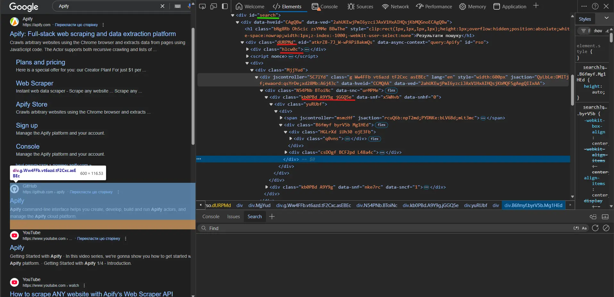
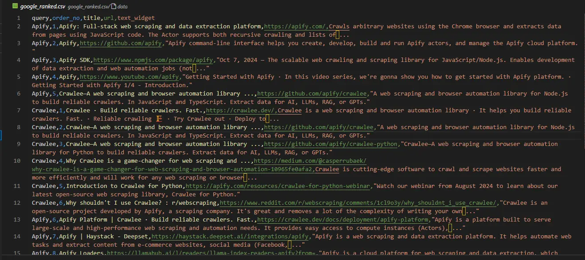

Scraping `Google Search` delivers essential `SERP analysis`, SEO optimization, and data collection capabilities. Modern scraping tools make this process faster and more reliable.

:::note
One of our community members wrote this blog as a contribution to the Crawlee Blog. If you would like to contribute blogs like these to Crawlee Blog, please reach out to us on our [discord channel](https://apify.com/discord).
:::

In this guide, we'll create a Google Search scraper using [`Crawlee for Python`](https://github.com/apify/crawlee-python) that can handle result ranking and pagination.

We'll create a scraper that:

- Extracts titles, URLs, and descriptions from search results
- Handles multiple search queries
- Tracks ranking positions
- Processes multiple result pages
- Saves data in a structured format

## Prerequisites

- Python 3.7 or higher
- Basic understanding of HTML and CSS selectors
- Familiarity with web scraping concepts
- Crawlee for Python v0.4.2 or higher

### Project setup

1. Install Crawlee with required dependencies:

    ```bash
    pipx install crawlee[beautifulsoup,curl-impersonate]
    ```

2. Create a new project using Crawlee CLI:

    ```bash
    pipx run crawlee create crawlee-google-search
    ```

3. When prompted, select `Beautifulsoup` as your template type.
4. Navigate to the project directory and complete installation:

    ```bash
    cd crawlee-google-search
    poetry install
    ```

## Development of the Google Search scraper in Python

### 1. Defining data for extraction

First, let's define our extraction scope. Google's search results now include maps, notable people, company details, videos, common questions, and many other elements. We'll focus on analyzing standard search results with rankings.

Here's what we'll be extracting:


Let's verify whether we can extract the necessary data from the page's HTML code, or if we need deeper analysis or `JS` rendering. Note that this verification is sensitive to HTML tags:


Based on the data obtained from the page, all necessary information is present in the HTML code. Therefore, we can use [`beautifulsoup_crawler`](https://www.crawlee.dev/python/docs/examples/beautifulsoup-crawler).

The fields we'll extract:

- Search result titles
- URLs
- Description text
- Ranking positions

### 2. Configure the crawler

First, let's create the crawler configuration.

We'll use [`CurlImpersonateHttpClient`](https://www.crawlee.dev/python/api/class/CurlImpersonateHttpClient) as our `http_client` with preset `headers` and `impersonate` relevant to the [`Chrome`](https://www.google.com/intl/en/chrome/) browser.

We'll also configure [`ConcurrencySettings`](https://www.crawlee.dev/python/api/class/ConcurrencySettings) to control scraping aggressiveness. This is crucial to avoid getting blocked by Google.

If you need to extract data more intensively, consider setting up [`ProxyConfiguration`](https://www.crawlee.dev/python/api/class/ProxyConfiguration).

```python
from crawlee.beautifulsoup_crawler import BeautifulSoupCrawler
from crawlee.http_clients.curl_impersonate import CurlImpersonateHttpClient
from crawlee import ConcurrencySettings, HttpHeaders

async def main() -> None:
    concurrency_settings = ConcurrencySettings(max_concurrency=5, max_tasks_per_minute=200)

    http_client = CurlImpersonateHttpClient(impersonate="chrome124",
                                            headers=HttpHeaders({"referer": "https://www.google.com/",
                                                     "accept-language": "en",
                                                     "accept-encoding": "gzip, deflate, br, zstd",
                                                     "user-agent": "Mozilla/5.0 (Windows NT 10.0; Win64; x64) AppleWebKit/537.36 (KHTML, like Gecko) Chrome/131.0.0.0 Safari/537.36"
                                            }))

    crawler = BeautifulSoupCrawler(
        max_request_retries=1,
        concurrency_settings=concurrency_settings,
        http_client=http_client,
        max_requests_per_crawl=10,
        max_crawl_depth=5
    )

    await crawler.run(['https://www.google.com/search?q=Apify'])
```

### 3. Implementing data extraction

First, let's analyze the HTML code of the elements we need to extract:



There's an obvious distinction between *readable* ID attributes and *generated* class names and other attributes. When creating selectors for data extraction, you should ignore any generated attributes. Even if you've read that Google has been using a particular generated tag for N years, you shouldn't rely on it - this reflects your experience in writing robust code.

Now that we understand the HTML structure, let's implement the extraction. As our crawler deals with only one type of page, we can use `router.default_handler` for processing it. Within the handler, we'll use `BeautifulSoup` to iterate through each search result, extracting data such as `title`, `url`, and `text_widget` while saving the results.

```python
@crawler.router.default_handler
async def default_handler(context: BeautifulSoupCrawlingContext) -> None:
    """Default request handler."""
    context.log.info(f'Processing {context.request} ...')

    for item in context.soup.select("div#search div#rso div[data-hveid][lang]"):
        data = {
            'title': item.select_one("h3").get_text(),
            "url": item.select_one("a").get("href"),
            "text_widget": item.select_one("div[style*='line']").get_text(),
        }
        await context.push_data(data)
```

### 4. Handling pagination

Since Google results depend on the IP geolocation of the search request, we can't rely on link text for pagination. We need to create a more sophisticated CSS selector that works regardless of geolocation and language settings.

The `max_crawl_depth` parameter controls how many pages our crawler should scan. Once we have our robust selector, we simply need to get the next page link and add it to the crawler's queue.

To write more efficient selectors, learn the basics of [CSS](https://www.w3schools.com/cssref/css_selectors.php) and [XPath](https://www.w3schools.com/xml/xpath_syntax.asp) syntax.

```python
    await context.enqueue_links(selector="div[role='navigation'] td[role='heading']:last-of-type > a")
```

### 5. Exporting data to CSV format

Since we want to save all search result data in a convenient tabular format like CSV, we can simply add the export_data method call right after running the crawler:

```python
await crawler.export_data_csv("google_search.csv")
```

### 6. Finalizing the Google Search scraper

While our core crawler logic works, you might have noticed that our results currently lack ranking position information. To complete our scraper, we need to implement proper ranking position tracking by passing data between requests using `user_data` in [`Request`](https://www.crawlee.dev/python/api/class/Request).

Let's modify the script to handle multiple queries and track ranking positions for search results analysis. We'll also set the crawling depth as a top-level variable. Let's move the `router.default_handler` to `routes.py` to match the project structure:

```python
# crawlee-google-search.main

from crawlee.beautifulsoup_crawler import BeautifulSoupCrawler, BeautifulSoupCrawlingContext
from crawlee.http_clients.curl_impersonate import CurlImpersonateHttpClient
from crawlee import Request, ConcurrencySettings, HttpHeaders

from .routes import router

QUERIES = ["Apify", "Crawlee"]

CRAWL_DEPTH = 2


async def main() -> None:
    """The crawler entry point."""

    concurrency_settings = ConcurrencySettings(max_concurrency=5, max_tasks_per_minute=200)

    http_client = CurlImpersonateHttpClient(impersonate="chrome124",
                                            headers=HttpHeaders({"referer": "https://www.google.com/",
                                                     "accept-language": "en",
                                                     "accept-encoding": "gzip, deflate, br, zstd",
                                                     "user-agent": "Mozilla/5.0 (Windows NT 10.0; Win64; x64) AppleWebKit/537.36 (KHTML, like Gecko) Chrome/131.0.0.0 Safari/537.36"
                                            }))
    crawler = BeautifulSoupCrawler(
        request_handler=router,
        max_request_retries=1,
        concurrency_settings=concurrency_settings,
        http_client=http_client,
        max_requests_per_crawl=100,
        max_crawl_depth=CRAWL_DEPTH
    )

    requests_lists = [Request.from_url(f"https://www.google.com/search?q={query}", user_data = {"query": query}) for query in QUERIES]

    await crawler.run(requests_lists)

    await crawler.export_data_csv("google_ranked.csv")
```

Let's also modify the handler to add `query` and `order_no` fields and basic error handling:

```python
# crawlee-google-search.routes

from crawlee.beautifulsoup_crawler import BeautifulSoupCrawlingContext
from crawlee.router import Router

router = Router[BeautifulSoupCrawlingContext]()


@router.default_handler
async def default_handler(context: BeautifulSoupCrawlingContext) -> None:
    """Default request handler."""
    context.log.info(f'Processing {context.request.url} ...')

    order = context.request.user_data.get("last_order", 1)
    query = context.request.user_data.get("query")
    for item in context.soup.select("div#search div#rso div[data-hveid][lang]"):
        try:
            data = {
                "query": query,
                "order_no": order,
                'title': item.select_one("h3").get_text(),
                "url": item.select_one("a").get("href"),
                "text_widget": item.select_one("div[style*='line']").get_text(),
            }
            await context.push_data(data)
            order += 1
        except AttributeError as e:
            context.log.warning(f'Attribute error for query "{query}": {str(e)}')
        except Exception as e:
            context.log.error(f'Unexpected error for query "{query}": {str(e)}')

    await context.enqueue_links(selector="div[role='navigation'] td[role='heading']:last-of-type > a",
                                user_data={"last_order": order, "query": query})
```

And we're done!

Our Google Search crawler is ready. Let's look at the results in the `google_ranked.csv` file:



The code repository is available on [`GitHub`](https://github.com/Mantisus/crawlee-google-search)

## Scrape Google Search results with Apify

If you're working on a large-scale project requiring millions of data points, like the project featured in this [article about Google ranking analysis](https://backlinko.com/search-engine-ranking) - you might need a ready-made solution.

Consider using [`Google Search Results Scraper`](https://www.apify.com/apify/google-search-scraper) by the Apify team.

It offers important features such as:

- Proxy support
- Scalability for large-scale data extraction
- Geolocation control
- Integration with external services like [`Zapier`](https://zapier.com/), [`Make`](https://www.make.com/), [`Airbyte`](https://airbyte.com/), [`LangChain`](https://www.langchain.com/) and others

You can learn more in the Apify [blog](https://blog.apify.com/unofficial-google-search-api-from-apify-22a20537a951/)

## What will you scrape?

In this blog, we've explored step-by-step how to create a Google Search crawler that collects ranking data. How you analyze this dataset is up to you!

As a reminder, you can find the full project code on [`GitHub`](https://github.com/Mantisus/crawlee-google-search).

I'd like to think that in 5 years I'll need to write an article on "How to extract data from the best search engine for LLMs", but I suspect that in 5 years this article will still be relevant.
